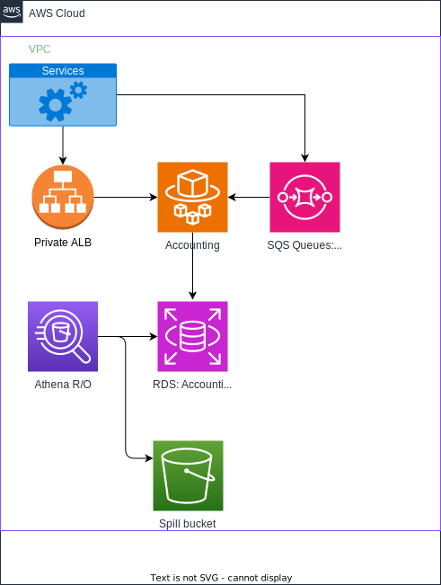

# Accounting Service

- **Description:** Tracks costs for services
- **Also known as:**
- **Source:** <https://github.com/openbraininstitute/accounting-service>
- **API:** <https://openbluebrain.com/api/accounting/docs>
- **AWS Dashboard:** <https://us-east-1.console.aws.amazon.com/cloudwatch/home?region=us-east-1#dashboards/dashboard/Accounting>
- **AWS Cluster:** <https://us-east-1.console.aws.amazon.com/ecs/v2/clusters/accounting_ecs_cluster/services?region=us-east-1>
- **Maintainer(s):**

## Overview

Tracks costs for services; when a service is launched it either sends a message via SQS saying it’s starting, and then when it ends or it uses an API call to do the same.
Future work: deploy multiple copies of this for HA.

## Goals

* Be able to break down costs at the `Project` level, as well as the `Virtual Lab` level.
* Be able to say 'how much credit is left, so that costs are capped to what the user has already paid for
  * Prior to a use of a cost incurring resource usage, the budget will be checked if there is enough money
