# Accounting service draft

## Requirements

### Functional requirements

* Users should be able to create and top-up their (funding) accounts.
* Subscription management for users.
* Funds management across v-lab/projects.
* Resource usage collection, user cost calculation and billing.
* Job termination when funds are exhausted.
* Users should have access to cost breakdown at both virtual lab and project level.
* Users should be able to see account balances, including reserved costs for currently running jobs.
* Admins should be able to control service prices/margins.
* Admins should be able to trace all transactions, see detailed and aggregated costs.

### Non-functional requirements

* High availability with minimal downtime for critical services.
* Double-spending/overspending prevention.
* Frequent user balance updates.

## High level architecture / data flow

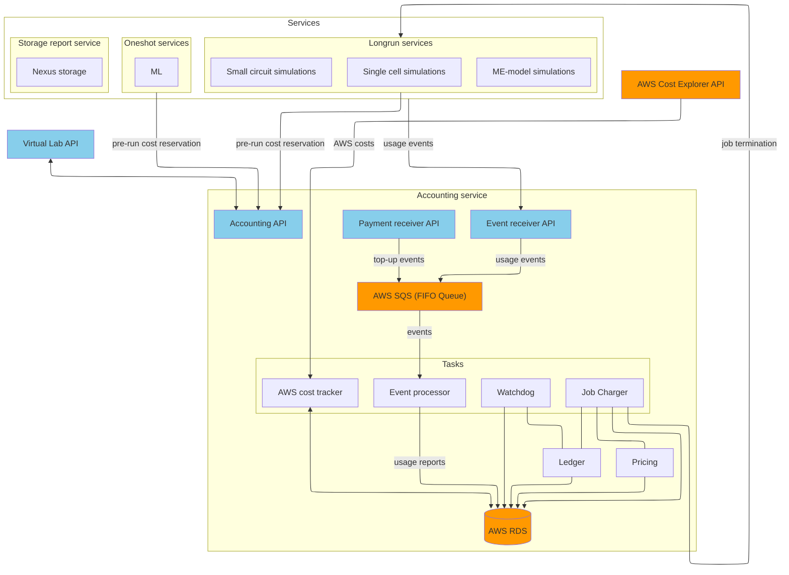

## General idea

The accounting service is meant to collect usage statistics from compute/storage services and to translate it into the user cost, which means:

* Updating virtual-lab/project budgets.
* Providing the user with detailed information about the usage and the cost of the resources spent.

## Compute services

Will handle two types of jobs by their billing model:

* `longrun`, which are billed by running time and used resources (e.g. underlying EC2 instance type, number of nodes). Examples: model building, simulations, analysis.
* `oneshot`, which are billed per execution with a fixed cost. Example: ML API calls.

These services will be responsible for:

* Executing pre-run checks to estimate the cost and reserve user funds for each execution.
* Providing usage statistics in a form of events which mark the start and the end of usage sessions as well as hearbeat signals.
* Listening for job termination requests from the accounting service (longrun jobs only).

## Storage report service

Is responsible to periodically collect the usage statistics for shared S3 buckets per each virtual-lab/project and provide it to the accounting service.

## Accounting service

### Ledger accessor

It is one of the core components of the accounting service, it's role is to track, manage and report funds across various system and user (v-lab/project) accounts. Uses [double entry accounting](https://en.wikipedia.org/wiki/Double-entry_bookkeeping) model.

The minimum list of accounts that are required for the service:

* User related accounts:
    * Main account per each virtual lab. This is a target for top-ups.
    * Main account per each project.
    * Reservation account per each project.
* System accounts:
    * Main platform account

Later on more accounts can be added, for example to track real AWS costs or other expenses.

SQL transactions **must** be used where applicable for concurrency control as well as to ensure data consistency and integrity.

### Event processor

It's responsible to collect from the AWS Simple Queue Service (SQS) and initiate processing for:

* Usage events from:
    * The compute service.
    * The storage report service.
* Top-up events from the payment provider.

### Job charger

A separate process that periodically charges users for their used storage and running jobs.

### Cost component

The component handles the following tasks:
1) Calculates user costs based on the usage reports by applying cost coefficient and fixed costs.
2) Handles cost estimation and reservation before any task is actually started (needed for double spent prevention).

### AWS cost tracker

Will provide insights about user billed costs and underlying platform AWS costs by mapping usage reports to data from AWS Cost Explorer API.
Can be used by platform administrators for analysis and decision making on service costs.

### Watchdog

It's responsible for:

- detecting abnormal termination of longrun jobs, i.e. when some time has passed without receiving any running or finish event.
  In this case, the job should be marked as terminated in the db, and the job charger should charge the user for the partial cost.
- detecting reserved job never started, i.e. when some time has passed without receiving any start event.
  In this case, the job should be marked as cancelled, and the job charger should release the reservation.

## Business logic

The process diagrams in this section are color-coded according the the job/event status as follows:

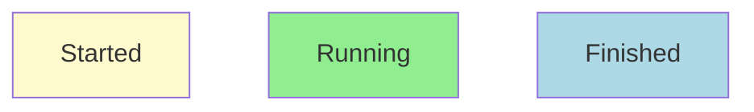

### Longrun jobs

#### Sequence diagram

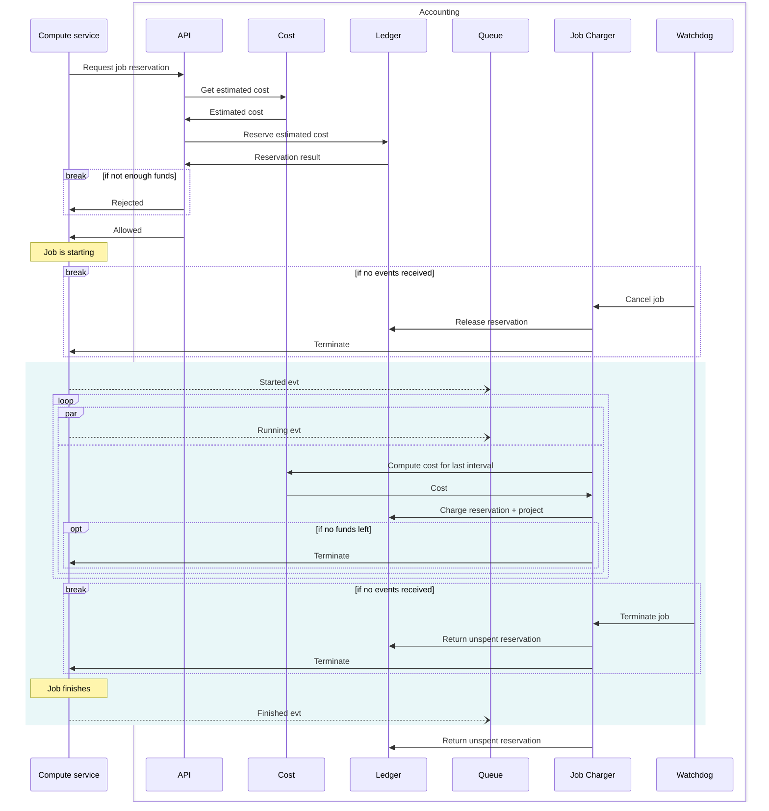

#### Process diagrams

##### Job execution request HTTP API calls

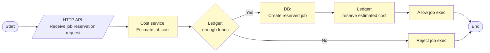

##### SQS events

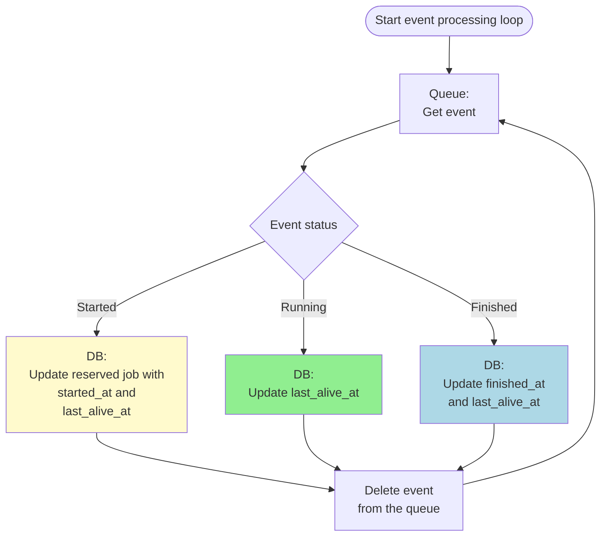

##### Periodic charging

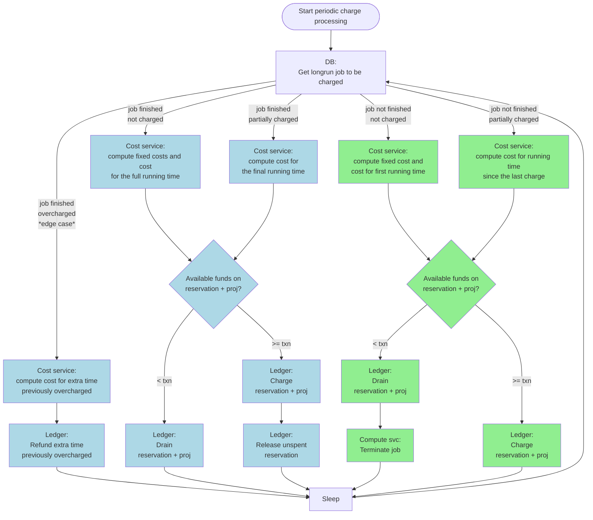

### Oneshot jobs

#### Sequence diagram

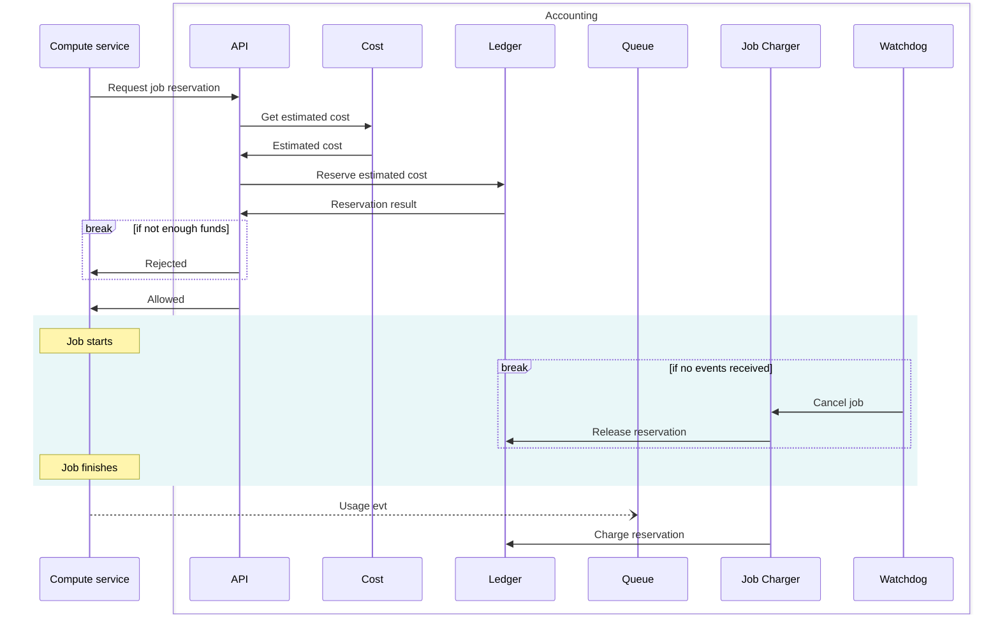

#### Process diagrams

##### Job execution request HTTP API calls

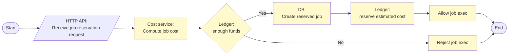

##### SQS events

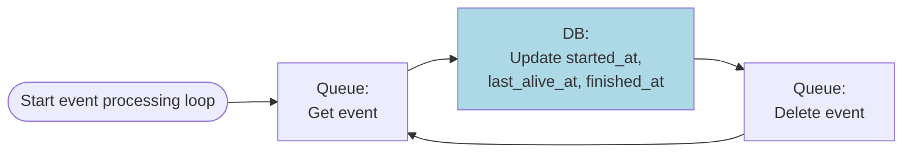

##### Periodic charging

The oneshot jobs are charged by the job charger in a separate task so that the event processor doesn't need to handle money transactions.

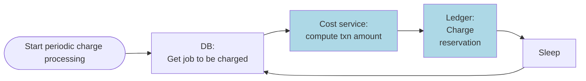

### Storage

#### Sequence diagram

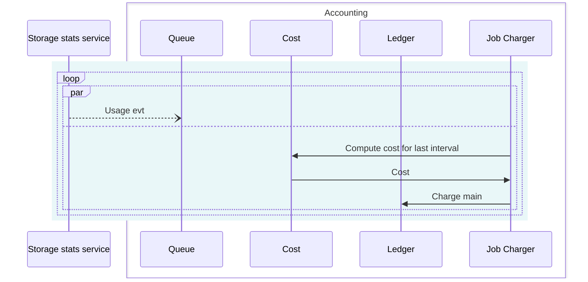

#### Process diagrams

#### SQS Events

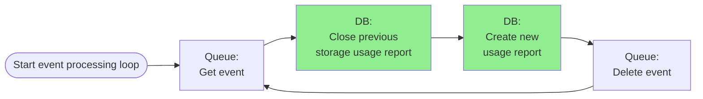

##### Periodic charging

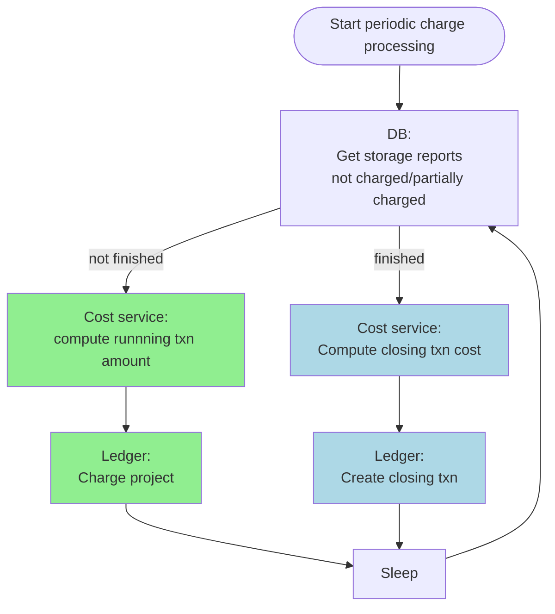

## SQS event format

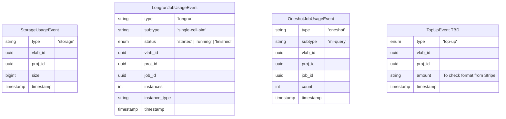

Notes:
- All the payloads must be json dicts with keys and values formatted as strings.
- The timestamps must be represented as unix time in milliseconds.
- The separator and case used for type and subtype should be always the same for consistency:
  - use lowercase names
  - use `-` instead of `_`
  - prefer single to plural names
- The list of valid subtypes needs to be decided yet, and it could evolve in the future.

## DB schemas

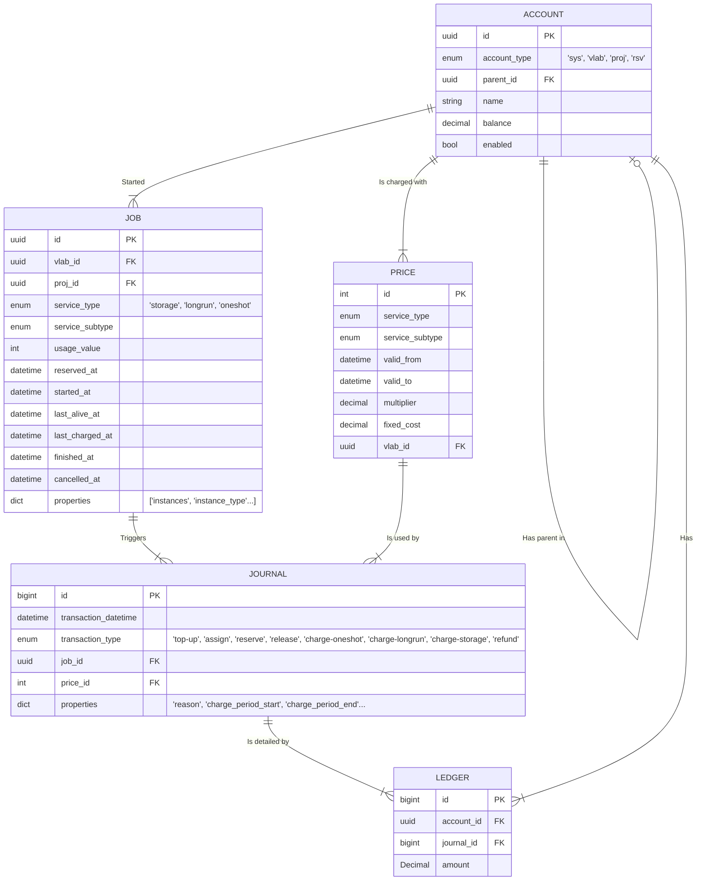
