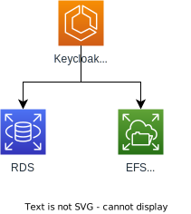

# Authentication and Authorization

- **Description:** Manages authentication and authorization
- **Also known as:** Keycloak
- **API:** <https://www.keycloak.org/docs-api/21.1.1/rest-api/>
- **AWS Dashboard:** <https://us-east-1.console.aws.amazon.com/cloudwatch/home?region=us-east-1#dashboards/dashboard/Keycloak>
- **AWS Service:** <https://us-east-1.console.aws.amazon.com/ecs/v2/clusters/sbo-keycloak-cluster/services/sbo-keycloak-service/health?region=us-east-1>
- **Maintainer(s):**

## Overview

