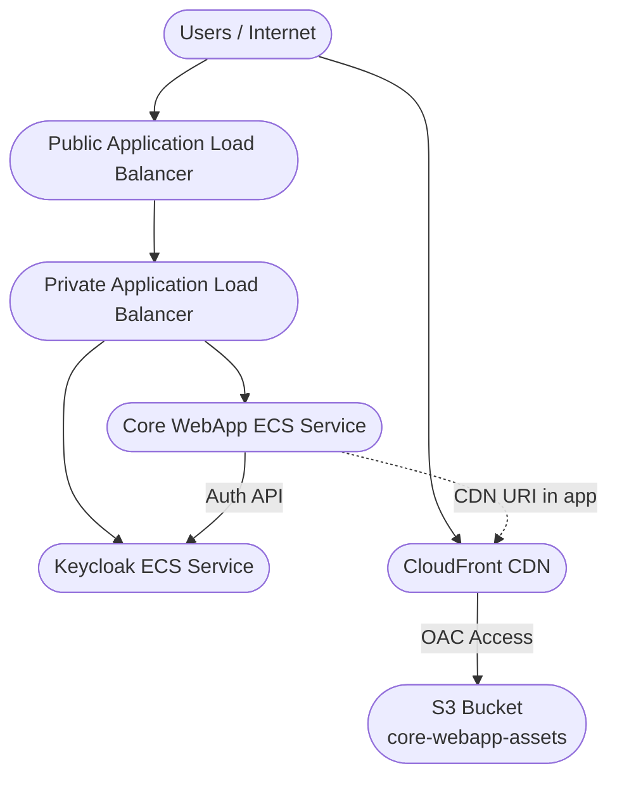
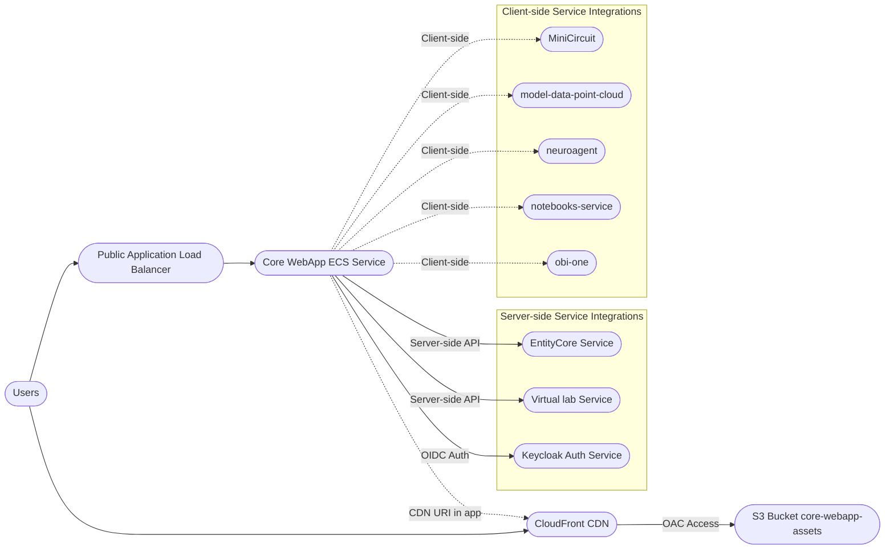

# Core Web App

- **Description:** OBI Web Application
- **Also known as:**
- **Source:** <https://github.com/openbraininstitute/core-web-app>
- **API:** <>
- **AWS Dashboard:** <https://us-east-1.console.aws.amazon.com/cloudwatch/home?region=us-east-1#dashboards/dashboard/CoreWebApp>
- **AWS Service:** <https://us-east-1.console.aws.amazon.com/ecs/v2/clusters/core_webapp_ecs_cluster/services/core_webapp_ecs_service/health?region=us-east-1>
- **Maintainer(s):**

## Overview

- This is the user interface for the Open Brain Institute platform.
- The primary objective is to empower users to create and manage virtual laboratories, enabling advanced exploration of neuroscience data, construction of computational models, execution of scientific experiments, and seamless interaction with virtual research environments.

## Features

| Feature                            | Description                                                                                                                 |
| ---------------------------------- | --------------------------------------------------------------------------------------------------------------------------- |
| Authentication & Authorization     | Secure user authentication and project-based access control using OpenID Connect via Keycloak.                              |
| Virtual Lab and Project Management | Provision, configure, and manage virtual labs; organize workspaces into projects with dedicated resource and cost tracking. |
| Data Exploration & Experimentation | Explore neuroscience data, build computational models, and run scientific experiments within virtual labs.                  |
| Dashboard & Activity Monitoring    | Centralized dashboard for monitoring labs, projects, costs, and system activities.                                          |
| Cost & Usage Tracking              | Real-time integration with the Accounting Service for granular resource usage and cost analytics.                           |
| Payment Processing                 | Stripe integration for secure, automated payment and subscription management.                                               |
| AI Agent                           | Interact with the platform using an integrated AI agent for enhanced productivity and support.                              |
| Documentation                      | Embedded and linked user documentation for onboarding and support.                                                          |

## Service Endpoints and Integrations

| Environment Variable                      | Service/Endpoint Description       | Example Value / URL                                          |
| ----------------------------------------- | ---------------------------------- | ------------------------------------------------------------ |
| NEXT_PUBLIC_ACCOUNTING_BASE_URL           | Accounting Service API             | https://www.openbraininstitute.org/api/accounting            |
| NEXT_PUBLIC_SMALL_SCALE_SIMULATOR_URL     | Small Scale Simulator API          | https://www.openbraininstitute.org/api/small-scale-simulator |
| NEXT_PUBLIC_CELL_SVC_BASE_URL             | Cell Service API (Circuit)         | https://www.openbraininstitute.org/api/circuit               |
| NEXT_PUBLIC_THUMBNAIL_GENERATION_BASE_URL | Thumbnail Generation Service       | https://www.openbraininstitute.org/api/thumbnail-generation  |
| NEXT_PUBLIC_VIRTUAL_LAB_API_URL           | Virtual Lab Manager API            | https://www.openbraininstitute.org/api/virtual-lab-manager   |
| NEXT_PUBLIC_NOTEBOOK_SERVICE_BASE_URL     | Notebook Service API               | https://www.openbraininstitute.org/api/notebook_service      |
| NEXT_PUBLIC_OBI_ONE_URL                   | OBI One API                        | https://www.openbraininstitute.org/api/obi-one               |
| NEXT_PUBLIC_MATOMO_URL                    | Analytics (Matomo)                 | https://openbraininstitute.matomo.cloud                      |
| NEXT_PUBLIC_AI_AGENT_URL                  | AI Agent API                       | https://www.openbraininstitute.org/api/agent/                |
| KEYCLOAK_URL                              | Authentication Provider (Keycloak) | https://openbraininstitute.org/auth/realms/SBO               |

## Technology stack

| Area             | Details                             |
| ---------------- | ----------------------------------- |
| Framework        | Next.js v15.4 (TypeScript)          |
| Testing          | Playwright (e2e), Vitest (unit)     |
| Type Safety      | TypeScript                          |
| Error Monitoring | Sentry (client/server)              |
| Payments         | Stripe (payment processing)         |
| CMS              | Sanity (content management)         |
| Analytics        | Matomo (privacy-friendly analytics) |
| Containerization | Docker                              |
| CI/CD            | GitHub Actions                      |

## Simplified Architecture Diagram

## Connectivity diagram

> **Note:** Server-side and client-side connections from core-web-app are grouped in separate groups for clarity. Server-side connections are based on value 1 in the matrix.xlsx ; client-side connections are services used from the client

