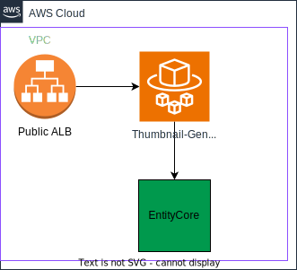

# Thumbnail Service

- **Description:** Generates small web friendly images of scientific artefacts
- **Also known as:**
- **Source:** <https://github.com/openbraininstitute/thumbnail-generation-api>
- **API:** <https://openbluebrain.com/api/thumbnail-generation/docs>
- **AWS Dashboard:** <https://us-east-1.console.aws.amazon.com/cloudwatch/home?region=us-east-1#dashboards/dashboard/Thumbnail-Generation>
- **AWS Service:** <https://us-east-1.console.aws.amazon.com/ecs/v2/clusters/thumbnail_generation_api_cluster/services/thumbnail-generation-api-service/health?region=us-east-1>
- **Maintainer(s):**

## Overview

